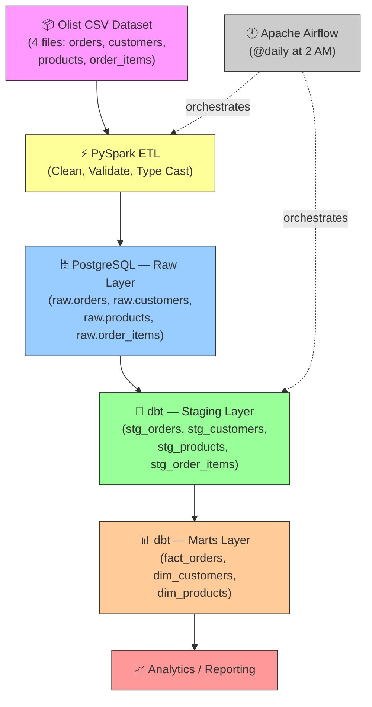
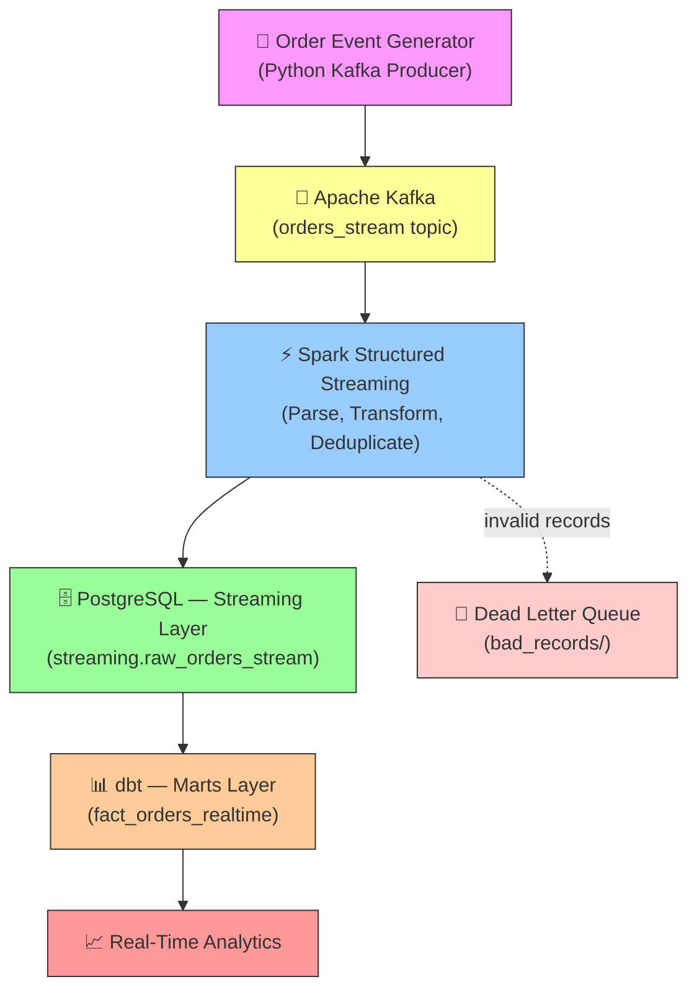

# E-Commerce Real-Time Data Pipeline

A production-style **batch + streaming data pipeline** built with PySpark, Apache Kafka, Spark Structured Streaming, PostgreSQL, dbt, and Apache Airflow using the Brazilian E-Commerce (Olist) dataset.

## Architecture

### Batch Pipeline



### Streaming Pipeline



## Tech Stack

| Technology | Purpose | Version |
|------------|---------|---------|
| **Python** | Core language | 3.12.10 |
| **PySpark** | Distributed ETL processing | 3.5.1 |
| **Apache Kafka** | Event streaming platform | 7.6.0 (Confluent) |
| **Spark Structured Streaming** | Real-time stream processing | 3.5.1 |
| **PostgreSQL** | Data warehouse (Dockerized) | 16 |
| **dbt** | Data transformation & modeling | 1.8.7 |
| **Apache Airflow** | Workflow orchestration | 2.10.0 |
| **Docker** | Container runtime | 29.5.3 |
| **Git/GitHub** | Version control | 2.45.2 |

## Dataset

**Brazilian E-Commerce Public Dataset by Olist** — [Kaggle](https://www.kaggle.com/datasets/olistbr/brazilian-ecommerce)

| File | Rows | Description |
|------|------|-------------|
| `olist_orders_dataset.csv` | ~99k | Order records with timestamps and status |
| `olist_order_items_dataset.csv` | ~112k | Line items with price and freight |
| `olist_customers_dataset.csv` | ~99k | Customer city and state |
| `olist_products_dataset.csv` | ~32k | Product categories |

## Data Warehouse Schema

### Batch — Star Schema (built by dbt)

**Fact Table:**
- `analytics.fact_orders` — order_id, customer_id, product_id, price, freight_value, purchase_timestamp

**Dimension Tables:**
- `analytics.dim_customers` — customer_id, customer_city, customer_state
- `analytics.dim_products` — product_id, product_category

### Streaming — Real-Time (built by dbt)

**Fact Table:**
- `analytics.fact_orders_realtime` — order_id, customer_id, product_id, amount, quantity, total_value, event_time, processing_time, order_date, order_hour

**Source Table:**
- `streaming.raw_orders_stream` — Landing table for Spark Structured Streaming data

## Setup

### Prerequisites

- Docker Desktop (24+)
- Python 3.12
- Java 21 (for PySpark)
- Git

### 1. Clone & Setup

```bash
git clone https://github.com/sameermungase/E-Commerce_Realtime_Data_Pipeline.git
cd E-Commerce_Realtime_Data_Pipeline
```

### 2. Start Infrastructure (PostgreSQL + Kafka)

```bash
docker compose up -d
```

This starts **4 services**:

| Service | Description |
|---------|-------------|
| `postgres` | Data warehouse on port 5433 |
| `zookeeper` | Kafka coordination on port 2181 |
| `kafka` | Message broker on port 29092 (host) |
| `kafka-init` | Creates `orders_stream` topic (runs once and exits) |

Verify Kafka topic:
```bash
docker exec ecommerce_kafka kafka-topics --bootstrap-server localhost:9092 --list
# Expected: orders_stream
```

### 3. Create Virtual Environment

```bash
python -m venv .venv
.venv\Scripts\activate          # Windows
pip install -r requirements.txt
```

### 4. Download Dataset

Download the [Olist dataset from Kaggle](https://www.kaggle.com/datasets/olistbr/brazilian-ecommerce) and place the 4 CSV files into `data/olist/`.

### 5. Run Batch Pipeline

```bash
# Set JAVA_HOME (if not set globally)
$env:JAVA_HOME = "path/to/java21"

# Run PySpark ETL
python batch/spark_etl.py

# Run dbt models
dbt run --project-dir dbt/ecommerce_dbt --profiles-dir dbt/ecommerce_dbt
```

### 6. Run Streaming Pipeline

```bash
# Terminal 1: Start the Kafka producer (generates ~30 events/minute)
python streaming/kafka_producer.py

# Terminal 2: Start the Spark Structured Streaming consumer
python streaming/spark_streaming.py

# Terminal 3: Verify data is flowing into PostgreSQL
docker exec ecommerce_postgres psql -U admin -d ecommerce \
  -c "SELECT COUNT(*) FROM streaming.raw_orders_stream;"
```

### 7. Run dbt for Streaming Models

```bash
dbt run --project-dir dbt/ecommerce_dbt --profiles-dir dbt/ecommerce_dbt --select fact_orders_realtime
```

### 8. Run via Airflow (Batch)

```bash
airflow standalone
airflow dags trigger daily_batch_pipeline
```

## Project Structure

```
├── batch/
│   ├── config.py                # Centralized batch configuration
│   ├── spark_etl.py             # PySpark batch ETL script
│   └── jars/                    # JDBC driver (gitignored)
├── streaming/
│   ├── config.py                # Centralized streaming configuration
│   ├── kafka_producer.py        # Fake order event generator
│   ├── spark_streaming.py       # Spark Structured Streaming consumer
│   ├── schema.py                # PySpark schema for stream events
│   ├── postgres_sink.py         # foreachBatch JDBC sink
│   └── dead_letter.py           # Dead letter queue handler
├── airflow/
│   └── dags/
│       └── daily_batch_pipeline.py
├── dbt/ecommerce_dbt/
│   ├── models/
│   │   ├── staging/             # Staging views (stg_*)
│   │   └── marts/               # Fact + dimension tables
│   │       ├── fact_orders.sql
│   │       ├── fact_orders_realtime.sql
│   │       ├── dim_customers.sql
│   │       └── dim_products.sql
│   ├── macros/
│   ├── dbt_project.yml
│   └── profiles.yml
├── postgres/
│   └── init.sql                 # Schema + table initialization
├── data/olist/                  # Olist CSV files (gitignored)
├── logs/                        # Application logs
├── bad_records/                 # Dead letter queue output
├── docker-compose.yml           # PostgreSQL + Kafka infrastructure
├── requirements.txt             # Python dependencies
├── .gitignore
└── README.md
```

## Pipeline Demo

### Batch Pipeline
```bash
# Trigger the full batch pipeline via Airflow:
airflow dags trigger daily_batch_pipeline
```

> **What happens:** Airflow schedules the workflow → PySpark transforms Olist order data → Data is loaded into PostgreSQL raw tables → dbt builds analytical star-schema models for reporting.

### Streaming Pipeline
```bash
# Start producer and consumer:
python streaming/kafka_producer.py &
python streaming/spark_streaming.py &
```

> **What happens:** The producer simulates live orders → Events are published to Kafka → Spark Structured Streaming consumes, transforms, deduplicates, and validates events → Valid records are written to PostgreSQL → dbt builds the `fact_orders_realtime` model for real-time analytics.

## Key Design Decisions

| Decision | Rationale |
|----------|-----------|
| **`foreachBatch` for JDBC writes** | Better control over retries, batching, and custom sink logic vs. direct JDBC sink |
| **Watermarking (10 min)** | Handles late-arriving data while bounding state size — common interview topic |
| **Dead letter queue** | Invalid records are captured, not silently dropped — demonstrates production thinking |
| **Dual Kafka listeners** | `PLAINTEXT` for inter-container comms, `PLAINTEXT_HOST` for host access |
| **Explicit schemas** | Stream uses `StructType` instead of `inferSchema` for reliability and performance |
| **Separate streaming schema** | Isolates batch (`raw`) and streaming (`streaming`) data in PostgreSQL |

## License

This project uses the [Olist Brazilian E-Commerce dataset](https://www.kaggle.com/datasets/olistbr/brazilian-ecommerce) under the CC BY-NC-SA 4.0 license.
