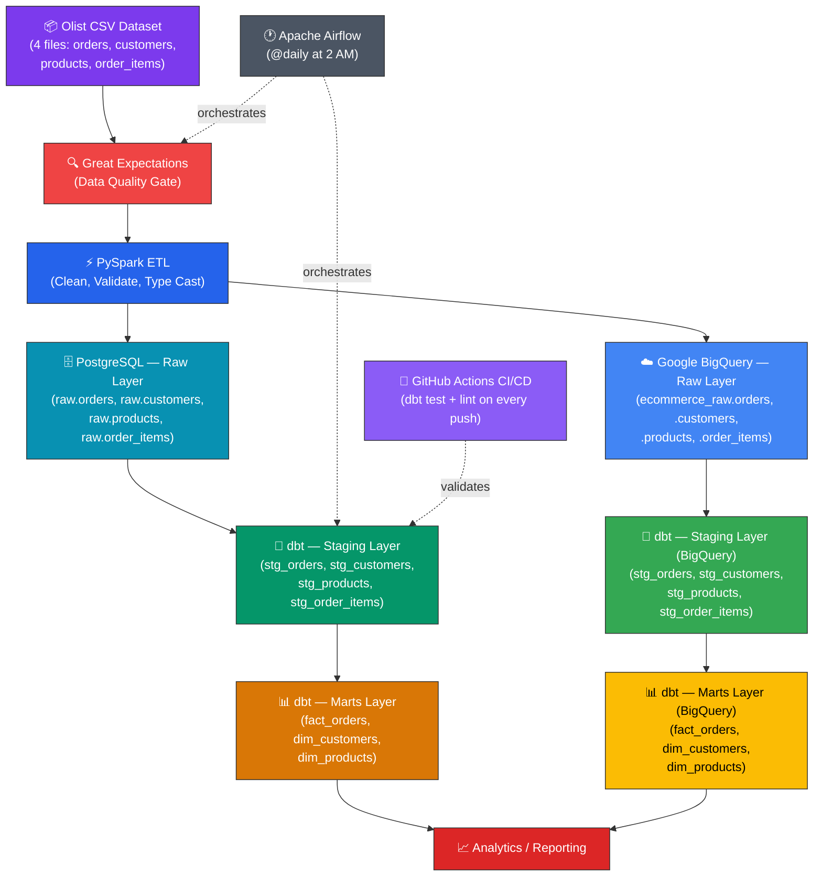
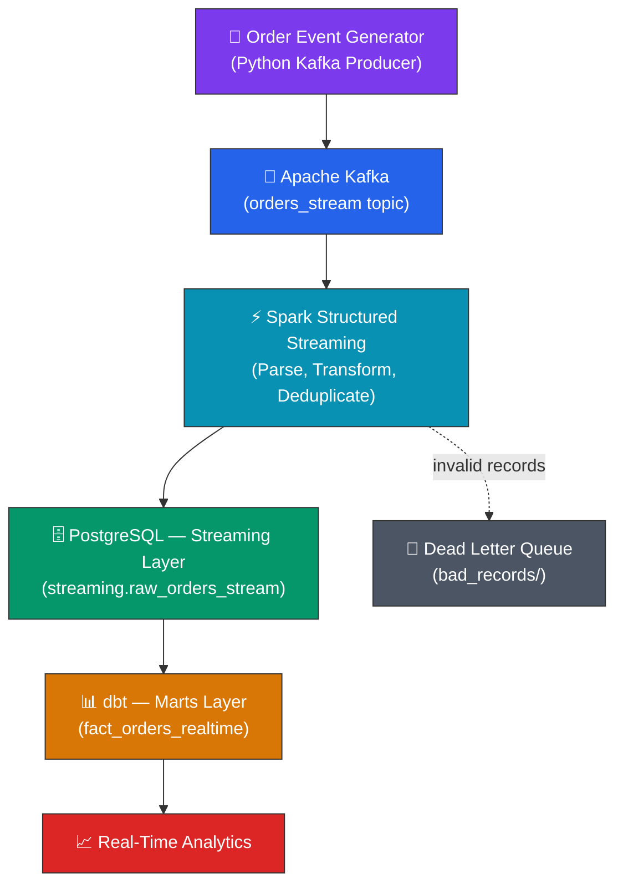
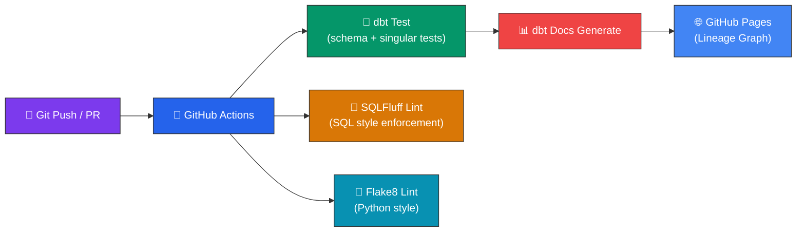

# E-Commerce Real-Time Data Pipeline

[](https://github.com/sameermungase/E-Commerce_Realtime_Data_Pipeline/actions/workflows/ci.yml)

A production-style **batch + streaming data pipeline** built with PySpark, Apache Kafka, Spark Structured Streaming, PostgreSQL, Google BigQuery (GCP), dbt, Great Expectations, Apache Airflow, and GitHub Actions CI/CD using the Brazilian E-Commerce (Olist) dataset.

## Architecture

### Batch Pipeline



### Streaming Pipeline



### Data Quality & CI/CD Pipeline



## Tech Stack

| Technology | Purpose | Version |
|------------|---------|---------|
| **Python** | Core language | 3.12.10 |
| **PySpark** | Distributed ETL processing | 3.5.1 |
| **Apache Kafka** | Event streaming platform | 7.6.0 (Confluent) |
| **Spark Structured Streaming** | Real-time stream processing | 3.5.1 |
| **PostgreSQL** | Local data warehouse (Dockerized) | 16 |
| **Google BigQuery** | Cloud data warehouse (GCP Sandbox) | — |
| **dbt** | Data transformation & modeling | 1.8.7 |
| **Great Expectations** | Data quality validation | 0.18+ |
| **Apache Airflow** | Workflow orchestration | 2.10.0 |
| **GitHub Actions** | CI/CD (dbt test + lint + docs) | — |
| **SQLFluff** | SQL linting & style enforcement | 3.0+ |
| **Docker** | Container runtime | 29.5.3 |
| **Git/GitHub** | Version control | 2.45.2 |

## Dataset

**Brazilian E-Commerce Public Dataset by Olist** — [Kaggle](https://www.kaggle.com/datasets/olistbr/brazilian-ecommerce)

| File | Rows | Description |
|------|------|-------------|
| `olist_orders_dataset.csv` | ~99k | Order records with timestamps and status |
| `olist_order_items_dataset.csv` | ~112k | Line items with price and freight |
| `olist_customers_dataset.csv` | ~99k | Customer city and state |
| `olist_products_dataset.csv` | ~32k | Product categories |

## Data Warehouse Schema

### Batch — Star Schema (built by dbt)

**Fact Table:**
- `analytics.fact_orders` — order_id, customer_id, product_id, price, freight_value, purchase_timestamp

**Dimension Tables:**
- `analytics.dim_customers` — customer_id, customer_city, customer_state
- `analytics.dim_products` — product_id, product_category

### Streaming — Real-Time (built by dbt)

**Fact Table:**
- `analytics.fact_orders_realtime` — order_id, customer_id, product_id, amount, quantity, total_value, event_time, processing_time, order_date, order_hour

**Source Table:**
- `streaming.raw_orders_stream` — Landing table for Spark Structured Streaming data

### BigQuery (Cloud Warehouse)

Same star schema deployed to Google BigQuery via `dbt run --target bigquery`:
- `ecommerce_raw.*` — Raw tables loaded by PySpark
- `ecommerce.staging.*` — Staging views
- `ecommerce.analytics.*` — Fact and dimension tables

## Setup

### Prerequisites

- Docker Desktop (24+)
- Python 3.12
- Java 21 (for PySpark)
- Git
- Google Cloud SDK (`gcloud`) — for BigQuery (optional)

### 1. Clone & Setup

```bash
git clone https://github.com/sameermungase/E-Commerce_Realtime_Data_Pipeline.git
cd E-Commerce_Realtime_Data_Pipeline
```

### 2. Start Infrastructure (PostgreSQL + Kafka)

```bash
docker compose up -d
# or: make infra
```

This starts **4 services**:

| Service | Description |
|---------|-------------|
| `postgres` | Data warehouse on port 5433 |
| `zookeeper` | Kafka coordination on port 2181 |
| `kafka` | Message broker on port 29092 (host) |
| `kafka-init` | Creates `orders_stream` topic (runs once and exits) |

Verify Kafka topic:
```bash
docker exec ecommerce_kafka kafka-topics --bootstrap-server localhost:9092 --list
# Expected: orders_stream
```

### 3. Create Virtual Environment

```bash
python -m venv .venv
.venv\Scripts\activate          # Windows
pip install -r requirements.txt
```

### 4. Download Dataset

Download the [Olist dataset from Kaggle](https://www.kaggle.com/datasets/olistbr/brazilian-ecommerce) and place the 4 CSV files into `data/olist/`.

### 5. Validate Source Data (Great Expectations)

```bash
python great_expectations/validate_sources.py
# or: make validate
```

> **What happens:** Great Expectations runs ~50 data quality checks across all 4 CSV files — validating schemas, null counts, uniqueness, value ranges, and row count thresholds. If any check fails, the pipeline halts before loading bad data.

### 6. Run Batch Pipeline

```bash
# Set JAVA_HOME (if not set globally)
$env:JAVA_HOME = "path/to/java21"

# Run PySpark ETL (PostgreSQL only)
python batch/spark_etl.py
# or: make etl

# Run PySpark ETL (PostgreSQL + BigQuery)
$env:ENABLE_BIGQUERY = "true"
python batch/spark_etl.py
# or: make etl-bq

# Install dbt packages (first time only)
dbt deps --project-dir dbt/ecommerce_dbt --profiles-dir dbt/ecommerce_dbt

# Run dbt models
dbt run --project-dir dbt/ecommerce_dbt --profiles-dir dbt/ecommerce_dbt

# Run dbt tests
dbt test --project-dir dbt/ecommerce_dbt --profiles-dir dbt/ecommerce_dbt
```

### 7. Run Streaming Pipeline

```bash
# Terminal 1: Start the Kafka producer (generates ~30 events/minute)
python streaming/kafka_producer.py

# Terminal 2: Start the Spark Structured Streaming consumer
python streaming/spark_streaming.py

# Terminal 3: Verify data is flowing into PostgreSQL
docker exec ecommerce_postgres psql -U admin -d ecommerce \
  -c "SELECT COUNT(*) FROM streaming.raw_orders_stream;"
```

### 8. Run dbt for Streaming Models

```bash
dbt run --project-dir dbt/ecommerce_dbt --profiles-dir dbt/ecommerce_dbt --select fact_orders_realtime
```

### 9. Run via Airflow (Batch)

```bash
airflow standalone
airflow dags trigger daily_batch_pipeline
```

> **Pipeline:** `validate_sources` → `spark_etl` → `dbt_run` → `dbt_test`

### 10. BigQuery Setup (GCP)

```bash
# 1. Authenticate with Google Cloud
gcloud auth login
gcloud auth application-default login
gcloud config set project exalted-cogency-499917-n4

# 2. Create the BigQuery dataset
bq mk --dataset exalted-cogency-499917-n4:ecommerce_raw

# 3. Run ETL with BigQuery enabled
$env:ENABLE_BIGQUERY = "true"
python batch/spark_etl.py

# 4. Run dbt against BigQuery
dbt run --project-dir dbt/ecommerce_dbt --profiles-dir dbt/ecommerce_dbt --target bigquery
```

## Data Quality

### Great Expectations (Pre-ETL Gate)

Validates raw CSV files **before** they enter the pipeline:

| Suite | Expectations | Validates |
|-------|-------------|-----------|
| `orders_suite` | 12 | Row count, PK uniqueness, order_status values, ID format |
| `customers_suite` | 12 | Row count, PK uniqueness, state code format, city names |
| `products_suite` | 7 | Row count, PK uniqueness, ID format, category lengths |
| `order_items_suite` | 15 | Row count, column existence, price/freight ranges |

### dbt Tests (Post-Transform)

| Test Type | Count | Examples |
|-----------|-------|---------|
| `not_null` | 20+ | All primary keys and foreign keys |
| `unique` | 8 | All primary keys |
| `accepted_values` | 1 | order_status valid values |
| `relationships` | 4 | fact_orders → dim_customers, dim_products |
| `accepted_range` | 6 | price ≥ 0, freight ≥ 0, amount > 0 |
| Singular tests | 1 | No orphaned order items |

## CI/CD (GitHub Actions)

Every push and PR triggers:

| Job | Description |
|-----|-------------|
| **dbt Build & Test** | Spins up Postgres service, runs `dbt run` + `dbt test` |
| **SQL & Python Lint** | SQLFluff (SQL style) + Flake8 (Python style) |
| **dbt Docs** | Generates lineage graph, deploys to GitHub Pages (main only) |

## Documentation

- **dbt Lineage Graph:** Auto-generated on every push to `main` and hosted via GitHub Pages
- **Generate locally:** `make dbt-docs`

## Makefile Commands

```bash
make help           # Show all available commands
make infra          # Start Docker infrastructure
make infra-down     # Stop Docker infrastructure
make validate       # Run Great Expectations on raw CSVs
make etl            # Run PySpark batch ETL (PostgreSQL)
make etl-bq         # Run PySpark batch ETL (PostgreSQL + BigQuery)
make stream-producer # Start Kafka producer
make stream-consumer # Start Spark Streaming consumer
make dbt-deps       # Install dbt packages
make dbt-run        # Run dbt models (PostgreSQL)
make dbt-run-bq     # Run dbt models (BigQuery)
make dbt-test       # Run dbt tests
make dbt-docs       # Generate and serve dbt docs
make lint           # Run all linters (SQL + Python)
make test           # Run all tests (GE + dbt)
make clean          # Stop Docker + clean temp files
```

## Project Structure

```
├── .github/
│   └── workflows/
│       └── ci.yml                  # GitHub Actions: dbt test + lint + docs
├── airflow/
│   └── dags/
│       └── daily_batch_pipeline.py # Airflow DAG: validate → ETL → dbt → test
├── batch/
│   ├── config.py                   # Batch config (PostgreSQL + BigQuery)
│   ├── spark_etl.py                # PySpark ETL (dual-warehouse support)
│   └── jars/                       # JDBC driver (gitignored)
├── streaming/
│   ├── config.py                   # Streaming configuration
│   ├── kafka_producer.py           # Fake order event generator
│   ├── spark_streaming.py          # Spark Structured Streaming consumer
│   ├── schema.py                   # PySpark schema for stream events
│   ├── postgres_sink.py            # foreachBatch JDBC sink
│   └── dead_letter.py              # Dead letter queue handler
├── dbt/ecommerce_dbt/
│   ├── models/
│   │   ├── staging/                # Staging views (stg_*)
│   │   │   ├── schema.yml          # Source + model tests
│   │   │   └── sources_bigquery.yml # BigQuery source definitions
│   │   └── marts/                  # Fact + dimension tables
│   │       ├── fact_orders.sql
│   │       ├── fact_orders_realtime.sql
│   │       ├── dim_customers.sql
│   │       ├── dim_products.sql
│   │       └── schema.yml          # Model tests (relationships, ranges)
│   ├── tests/
│   │   └── assert_no_orphan_order_items.sql  # Custom singular test
│   ├── macros/
│   ├── packages.yml                # dbt-utils dependency
│   ├── dbt_project.yml
│   └── profiles.yml                # PostgreSQL + BigQuery targets
├── great_expectations/
│   ├── great_expectations.yml      # GE project config
│   ├── expectations/
│   │   ├── orders_suite.json       # 12 expectations
│   │   ├── customers_suite.json    # 12 expectations
│   │   ├── products_suite.json     # 7 expectations
│   │   └── order_items_suite.json  # 15 expectations
│   └── validate_sources.py         # Pre-ETL validation script
├── postgres/
│   └── init.sql                    # Schema + table initialization
├── data/olist/                     # Olist CSV files (gitignored)
├── logs/                           # Application logs
├── bad_records/                    # Dead letter queue output
├── .sqlfluff                       # SQL linting configuration
├── .sqlfluffignore                 # SQL lint ignore patterns
├── docker-compose.yml              # PostgreSQL + Kafka infrastructure
├── Makefile                        # Common commands
├── requirements.txt                # Python dependencies
├── .gitignore
└── README.md
```

## Key Design Decisions

| Decision | Rationale |
|----------|-----------|
| **Dual warehouse (PostgreSQL + BigQuery)** | PostgreSQL for local dev, BigQuery for cloud — demonstrates multi-target dbt proficiency |
| **`foreachBatch` for JDBC writes** | Better control over retries, batching, and custom sink logic vs. direct JDBC sink |
| **Watermarking (10 min)** | Handles late-arriving data while bounding state size — common interview topic |
| **Dead letter queue** | Invalid records are captured, not silently dropped — demonstrates production thinking |
| **Great Expectations pre-ETL gate** | Validates data quality at ingestion — prevents bad data from entering the warehouse |
| **GitHub Actions CI/CD** | Automated testing and linting on every push — demonstrates DevOps awareness |
| **dbt Docs on GitHub Pages** | Auto-generated data lineage graph — shows data governance capabilities |
| **Dual Kafka listeners** | `PLAINTEXT` for inter-container comms, `PLAINTEXT_HOST` for host access |
| **Explicit schemas** | Stream uses `StructType` instead of `inferSchema` for reliability and performance |
| **Separate streaming schema** | Isolates batch (`raw`) and streaming (`streaming`) data in PostgreSQL |
| **Makefile** | Single entry point for all operations — demonstrates engineering maturity |

## License

This project uses the [Olist Brazilian E-Commerce dataset](https://www.kaggle.com/datasets/olistbr/brazilian-ecommerce) under the CC BY-NC-SA 4.0 license.
