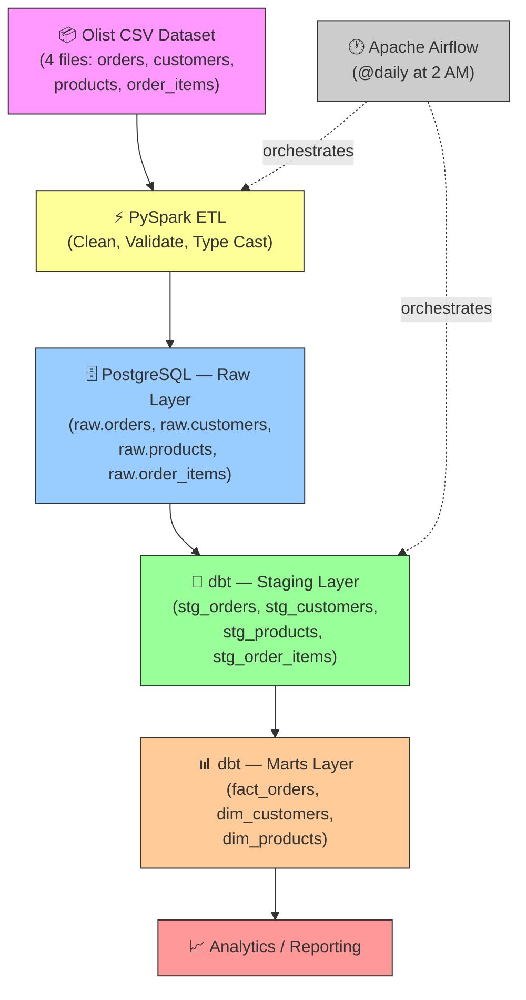

# E-Commerce Real-Time Data Pipeline

A production-style **batch ETL pipeline** built with PySpark, PostgreSQL, dbt, and Apache Airflow using the Brazilian E-Commerce (Olist) dataset.

## Architecture



## Tech Stack

| Technology | Purpose | Version |
|------------|---------|---------|
| **Python** | Core language | 3.12.10 |
| **PySpark** | Distributed ETL processing | 3.5.1 |
| **PostgreSQL** | Data warehouse (Dockerized) | 16 |
| **dbt** | Data transformation & modeling | 1.8.7 |
| **Apache Airflow** | Workflow orchestration | 2.10.0 |
| **Docker** | Container runtime | 29.5.3 |
| **Git/GitHub** | Version control | 2.45.2 |

## Dataset

**Brazilian E-Commerce Public Dataset by Olist** — [Kaggle](https://www.kaggle.com/datasets/olistbr/brazilian-ecommerce)

| File | Rows | Description |
|------|------|-------------|
| `olist_orders_dataset.csv` | ~99k | Order records with timestamps and status |
| `olist_order_items_dataset.csv` | ~112k | Line items with price and freight |
| `olist_customers_dataset.csv` | ~99k | Customer city and state |
| `olist_products_dataset.csv` | ~32k | Product categories |

## Data Warehouse Schema

### Star Schema (built by dbt)

**Fact Table:**
- `analytics.fact_orders` — order_id, customer_id, product_id, price, freight_value, purchase_timestamp

**Dimension Tables:**
- `analytics.dim_customers` — customer_id, customer_city, customer_state
- `analytics.dim_products` — product_id, product_category

## Setup

### Prerequisites

- Docker Desktop (24+)
- Python 3.12
- Java 21 (for PySpark)
- Git

### 1. Clone & Setup

```bash
git clone https://github.com/sameermungase/E-Commerce_Realtime_Data_Pipeline.git
cd E-Commerce_Realtime_Data_Pipeline
```

### 2. Start PostgreSQL

```bash
docker compose up -d
```

### 3. Create Virtual Environment

```bash
python -m venv .venv
.venv\Scripts\activate          # Windows
pip install -r requirements.txt
```

### 4. Download Dataset

Download the [Olist dataset from Kaggle](https://www.kaggle.com/datasets/olistbr/brazilian-ecommerce) and place the 4 CSV files into `data/olist/`.

### 5. Run Pipeline

```bash
# Set JAVA_HOME (if not set globally)
$env:JAVA_HOME = "path/to/java21"

# Run PySpark ETL
python batch/spark_etl.py

# Run dbt models
dbt run --project-dir dbt/ecommerce_dbt --profiles-dir dbt/ecommerce_dbt
```

### 6. Run via Airflow

```bash
airflow standalone
airflow dags trigger daily_batch_pipeline
```

## Project Structure

```
├── data/olist/              # Olist CSV files (gitignored)
├── batch/
│   ├── config.py            # Centralized configuration
│   └── spark_etl.py         # PySpark ETL script
├── airflow/dags/            # Airflow DAG definitions
├── dbt/ecommerce_dbt/       # dbt project (staging + marts)
├── postgres/init.sql        # DB schema initialization
├── docker-compose.yml       # PostgreSQL container
├── requirements.txt         # Python dependencies
└── README.md
```

## Pipeline Demo

```bash
# Trigger the full pipeline via Airflow:
airflow dags trigger daily_batch_pipeline
```

> **What happens:** Airflow schedules the workflow → PySpark transforms Olist order data → Data is loaded into PostgreSQL raw tables → dbt builds analytical star-schema models for reporting.

## License

This project uses the [Olist Brazilian E-Commerce dataset](https://www.kaggle.com/datasets/olistbr/brazilian-ecommerce) under the CC BY-NC-SA 4.0 license.
